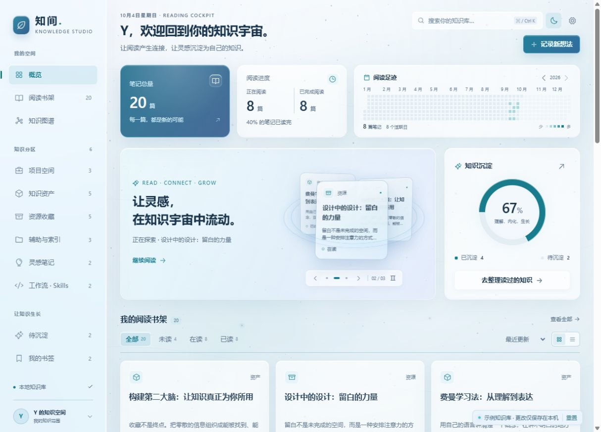

# 知间 · Knowledge Studio

一个为 Obsidian 开发的本地阅读与知识工作台。用双主题 3D 毛玻璃、流动光场、粒子和悬浮笔记，让知识库里的内容更容易阅读、连接与整理。

**作者的 Obsidian 知识库采用 Andrej Karpathy（卡帕西）的 LLM Wiki 知识库架构。** 知间为这套知识工作流提供阅读书架、知识分区、沉淀状态和关系图谱界面。项目作者：Y。




## 功能

- **双主题玻璃界面**：星夜深色 / 冰蓝浅色，WebGL 流动光场、Canvas 纵深粒子、鼠标倾斜与玻璃高光。
- **3D 笔记轮换**：三张真实笔记每 3.5 秒轮换；支持手动切换、暂停，悬停、聚焦和后台自动暂停。
- **阅读概览**：正在阅读与已完成阅读合并为一张统计卡；年度足迹占两张统计卡宽度并保持等高；轮换面板与沉淀百分比并排等高，书架使用全部内容宽度。
- **知识管理**：六类分区、搜索、阅读状态筛选、排序、卡片 / 列表、书签、Markdown 详情与新想法记录。
- **关系图谱**：本地点线力导向布局，节点拖动、画布平移、缩放、分区筛选、孤立笔记开关、悬停邻居与键盘定位。
- **水中生长动画**：每次进入图谱，节点从中心依次加入，带着阻尼和惯性推动周围节点让位；镜头稳定，名称平滑渐显，收敛后保持轻微漂浮。
- **响应式布局**：适配桌面、手机与 Obsidian 窄面板；支持丰富 / 轻柔 / 静止动效以及系统减少动态效果偏好。


## LLM Wiki 架构来源

架构参考 Karpathy 的原始 [LLM Wiki idea file](https://gist.github.com/karpathy/442a6bf555914893e9891c11519de94f)。其核心是让 LLM 持续维护有交叉引用的 Markdown 知识库，把来源逐步整理为可以积累和再次使用的知识。

作者的知识库按这三层职责组织，并结合项目、资产、资源、辅助、灵感与 Skills 六类分区：

| 层次 | 职责 | 知间中的对应方式 |
| --- | --- | --- |
| 原始资料 | 保留来源，供阅读和引用 | `03-资源/原始资料` 在工作台内保持只读 |
| Wiki 页面 | 维护摘要、概念、实体和关联 | Markdown 笔记、双向链接、阅读与沉淀状态、关系图谱 |
| Schema | 约定目录、页面格式与维护流程 | 知识库自己的 `AGENTS.md` / `CLAUDE.md`，以及页面 YAML 属性 |

`index.md` 负责知识导航，`log.md` 记录维护活动。LLM Wiki 的摄入、问答和维护由作者选择的 LLM Agent 与知识库规范完成；知间负责本地展示、阅读管理及明确的笔记操作。插件运行时无需 LLM API、远程字体或外部服务。

目录映射是本项目的具体实践；Karpathy 的文档提供架构思想，知间是独立开发的 Obsidian 插件。

## 安装

Obsidian 版本要求：**1.5.0 或以上**。

1. 下载本仓库，或下载 [Release 交付包](https://github.com/useroneoneone/zhijian-obsidian/releases/latest)。
2. 在你的知识库中创建 `.obsidian/plugins/zhijian-studio/`。
3. 从 `zhijian-obsidian/` 复制 `main.js`、`manifest.json`、`styles.css` 到该目录。
4. 在 Obsidian「设置 → 第三方插件」启用「知间 · Knowledge Studio」。
5. 按 `Ctrl/Cmd + P` 执行「打开知间知识工作台」，或点击左侧工作台图标。支持「在右侧栏打开知间」。

搜索、主题与界面设置位于各页签「记录新想法」上方。`Ctrl/Cmd + K` 聚焦搜索；点击阅读统计可进入相应书架筛选。

详情、属性约定、目录映射及写入行为见 [插件中文说明](zhijian-obsidian/README.md)。

## 离线预览

直接打开 `preview/index.html`，或在安装了 Node.js 的机器上运行：

```sh
node preview-server.mjs
```

然后访问 `http://127.0.0.1:4177/preview/index.html`。Windows 可双击 `start-preview.cmd`。

预览包含 20 篇原创中文示例笔记。更改只保存在当前浏览器；右下角「重置」恢复示例。预览与真实知识库相互独立。

## 开发与校验

需要 Node.js 18 或以上。构建依赖固定为 esbuild 0.28.2。

```sh
cd zhijian-obsidian
npm ci --ignore-scripts
npm run build
npm test
```

构建只保留 Obsidian 提供的 `obsidian` 运行时依赖。UI 和动效模块由原生视图与离线预览复用；源码和许可证随仓库提供。

`npm test` 按顺序运行 7 个回归文件，覆盖数据适配、图谱物理布局、轮换生命周期、背景资源清理及离线示例；均已通过。桌面和窄屏关键交互也已验证。原生适配器使用 API mock 验证；真实 Obsidian 应用首次加载仍待验收。

## 数据与写入

搜索和浏览只建立本地索引。修改状态会更新选中笔记的 YAML 属性；新建想法会创建 Markdown 页面并维护索引与日志。默认排除私密目录，原始资料在工作台内保持只读。仓库只包含插件、文档、截图与示例。

## 参考与许可

- [Andrej Karpathy · LLM Wiki](https://gist.github.com/karpathy/442a6bf555914893e9891c11519de94f)
- [Baixiao-Reading-Cockpit](https://github.com/csuyincs-creator/Baixiao-Reading-Cockpit)
- [白晓知识库分享 · 飞书](https://my.feishu.cn/wiki/DHOowqi6liFQc6kOLidcSgZnnef)
- [Obsidian 官方图谱说明](https://obsidian.md/help/plugins/graph)
- [Phosphor Icons](https://github.com/phosphor-icons/phosphor-core)

源码采用 [MIT 许可证](zhijian-obsidian/LICENSE)。第三方版权说明见 [THIRD_PARTY_NOTICES.md](zhijian-obsidian/THIRD_PARTY_NOTICES.md)。
