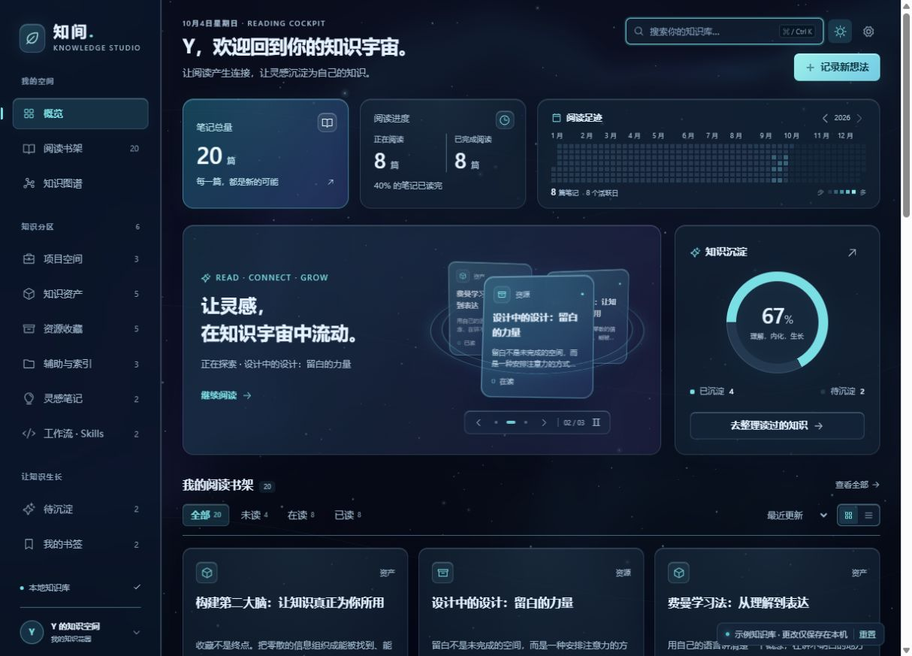
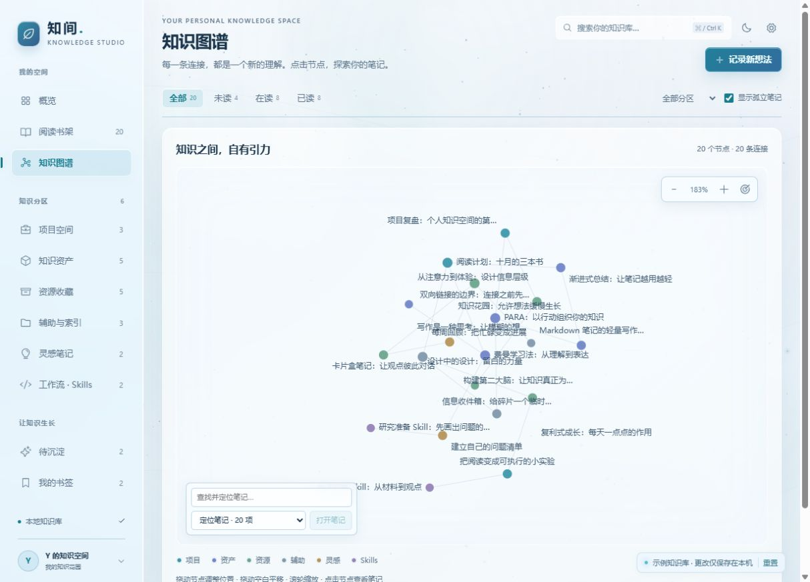

# 知间 · 3D 玻璃知识工作台

为你的 Obsidian 知识库开发的独立插件，提供星夜深色与冰蓝浅色两套界面。

作者的 Obsidian 知识库采用 Andrej Karpathy（卡帕西）的 [LLM Wiki 知识库架构](https://gist.github.com/karpathy/442a6bf555914893e9891c11519de94f)，以原始资料、Markdown Wiki 和维护规范组织知识。知间提供对应的本地阅读与管理界面。

## 立即查看

当前动态预览：<http://127.0.0.1:4177/preview/index.html>。

以后可双击 `start-preview.cmd` 启动本地预览，或直接打开 `preview/index.html`。预览使用 20 篇原创示例笔记，更改保存在当前浏览器中。

## 在你的知识库使用

将 `zhijian-obsidian/` 中的 `main.js`、`manifest.json`、`styles.css` 放入你的知识库 `.obsidian/plugins/zhijian-studio/` 目录。

1. 重启 Obsidian 或刷新第三方插件列表。
2. 在「设置 → 第三方插件」启用「知间 · Knowledge Studio」。如果正在使用受限模式，通过该设置页开启第三方插件。
3. 按 `Ctrl + P`，执行「打开知间知识工作台」，或点击左侧工作台图标。

右上角设置可以切换主题及「丰富 / 轻柔 / 静止」动效。完整使用与开发说明见 [插件说明](zhijian-obsidian/README.md)。

## 已完成的界面

- WebGL 流动光场、具有纵深的 Canvas 粒子、CSS 3D 悬浮笔记、鼠标倾斜和玻璃高光。
- 首页三张 3D 玻璃卡片每 3.5 秒自动轮换，支持悬停暂停、手动切换及暂停按钮。
- 全部页签统一紧凑页头：搜索、主题与设置位于「记录新想法」上方。正在阅读与已完成阅读合并，阅读足迹占两张统计卡的宽度并保持等高；轮换卡片与沉淀百分比并排等高，书架全宽展示。窄屏时按阅读顺序自动换行。
- 六类知识分区、搜索、卡片与列表、书签、Markdown 详情、阅读及知识沉淀状态。
- 年度阅读热力图、知识沉淀进度和力导向笔记图谱：小圆点与细线、拖动节点、平移与缩放、悬停高亮相邻笔记。
- 每次打开图谱播放约 3.2 秒的水中生长：节点逐个从中心加入，新节点轻推周围节点，带着迟滞和惯性让位；继续自然收敛后保留轻微漂浮。镜头保持稳定，名称渐显后固定在节点旁，减少闪烁跳位。系统减少动效时直接展示完整图谱。
- 桌面、手机与 Obsidian 窄面板布局；系统减少动效偏好及后台暂停。

浏览和刷新只读。修改状态才写入选定笔记属性；新建笔记会同步索引与日志。默认排除私密目录，原始资料在工作台内保持只读。

已完成浏览器交互、数据契约和动效生命周期验证；真实 Obsidian 应用的首次加载留待启用插件后验收。

